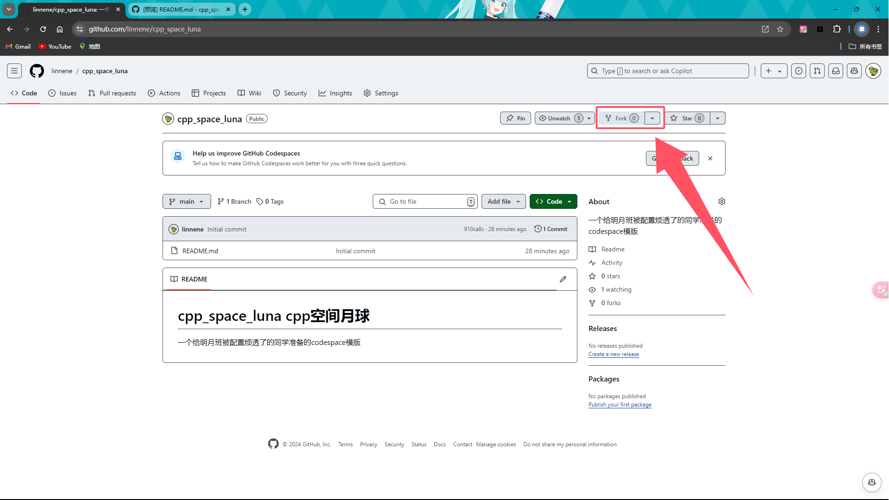

# cpp_space_luna

---

<aside>
💡

**一个给被配置烦透了的同学准备的codespace模版**

</aside>

---

# luna_codespace使用说明(请详细阅读)

---

# a. 我希望你拥有了github账号和学生优惠

**Tips：**

**这是很简单的，注册github账号：**

[Github注册详细教程（含失败原因分析）_github注册不了-CSDN博客](https://blog.csdn.net/qq_41798899/article/details/120133809?ops_request_misc=%257B%2522request%255Fid%2522%253A%25229FC296D3-761C-4F87-BAB8-C447257F922A%2522%252C%2522scm%2522%253A%252220140713.130102334..%2522%257D&request_id=9FC296D3-761C-4F87-BAB8-C447257F922A&biz_id=0&utm_medium=distribute.pc_search_result.none-task-blog-2~all~top_positive~default-1-120133809-null-null.142^v100^pc_search_result_base2&utm_term=github%E6%B3%A8%E5%86%8C%E6%95%99%E7%A8%8B&spm=1018.2226.3001.4187)

**以及学生优惠的获取：**

[Github学生认证-CSDN博客](https://blog.csdn.net/2301_78630677/article/details/138173254?ops_request_misc=%257B%2522request%255Fid%2522%253A%2522FCC479ED-4E00-44D6-AE1D-1973751A193E%2522%252C%2522scm%2522%253A%252220140713.130102334..%2522%257D&request_id=FCC479ED-4E00-44D6-AE1D-1973751A193E&biz_id=0&utm_medium=distribute.pc_search_result.none-task-blog-2~all~top_click~default-2-138173254-null-null.142^v100^pc_search_result_base2&utm_term=github%E5%AD%A6%E7%94%9F%E8%AE%A4%E8%AF%81&spm=1018.2226.3001.4187)

# b. fork我的github仓库页面

## 1. 前往我的github仓库页面：

[https://github.com/linnene/cpp_space_luna](https://github.com/linnene/cpp_space_luna)

## 2. Fork这个仓库：

1. 点击这个[**“Fork”**](https://github.com/linnene/cpp_space_luna)

1. 取消**“only fork the main”**
    
    無圖
    

## 3. 來到自己的倉庫頁面：

1. **点击上面的的“code” :**

<aside>
💡

**Fin. 接下來，你就可以使用这个已经配置好的CodeSpace了**

</aside>

新建一个文件夹来存放你的代码

点击debug图标，点击生成即可

